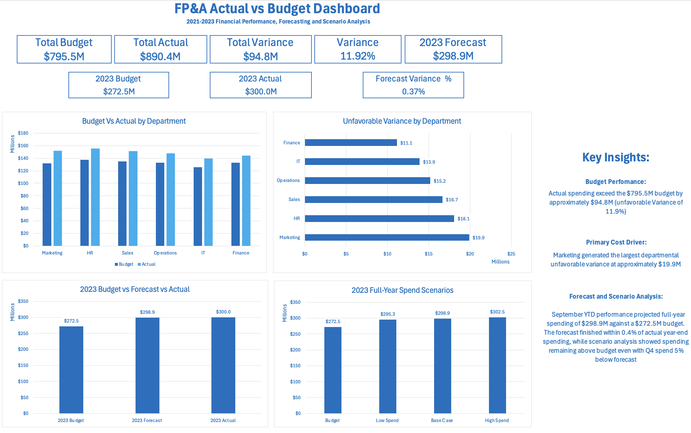

# FP&A Budget vs Actual Analysis

## Project Overview

Analysis of 10,000+ corporate financial transactions from 2021–2023, evaluating budget performance, spending drivers and full-year forecasting.

## Tools

- MySQL
- Microsoft Excel

## Key Results

- Analyzed $795.5M in budgeted spending against $890.4M in actual spending
- Identified a $94.8M unfavorable variance (11.9%)
- Identified Marketing as the largest departmental variance driver at approximately $19.9M
- Built a September YTD run-rate forecast projecting $298.9M in 2023 full-year spending
- Forecast finished within 0.4% of actual year-end spending
- Scenario analysis showed spending remained above budget even with Q4 spending 5% below the base forecast

## Dashboard

## Analysis

### Budget vs Actual
Explain what you analyzed.

### Variance Analysis
Explain department, category and regional analysis.

### Forecasting
Explain the September YTD methodology.

### Scenario Analysis
Explain the -5%, Base and +5% Q4 scenarios.

## Files

- `FP&A_Budget_Variance_Analysis.xlsx` — Complete Excel analysis and dashboard

## Key Takeaway

By September 2023, spending trends indicated that the annual budget would be exceeded. The run-rate forecast projected $298.9M in full-year spending and ultimately finished within 0.4% of the $300.0M actual result.
